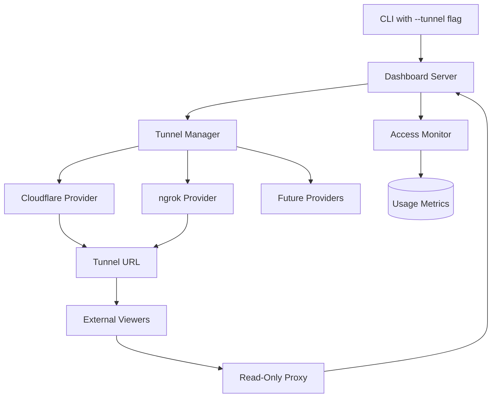
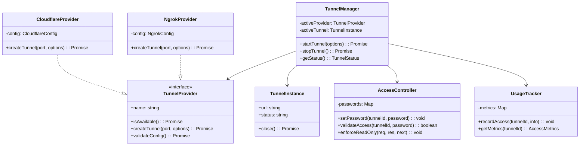

# Design Document: Dashboard Tunnel Feature

## Overview

The dashboard tunnel feature enables developers to securely share their local Claude Code Spec Workflow dashboard with external stakeholders through temporary HTTPS URLs. This design leverages existing tunnel providers while maintaining security and simplicity.

## Steering Document Alignment

### Technical Standards (tech.md)
- Maintains TypeScript strict mode and CommonJS compatibility
- Extends existing Fastify server without major architectural changes
- Follows established error handling and logging patterns
- Preserves offline capability for core features

### Project Structure (structure.md)
- New tunnel module within `src/dashboard/tunnel/`
- Follows existing separation of concerns pattern
- Maintains dashboard as self-contained subsystem
- Configuration follows established patterns

## Architecture

### High-Level Design



### Component Architecture



## Components and Interfaces

### TunnelManager
```typescript
interface TunnelOptions {
  provider?: 'cloudflare' | 'ngrok' | 'auto';
  password?: string;
  maxViewers?: number;
  ttl?: number; // Time to live in minutes
  analytics?: boolean;
}

interface TunnelInfo {
  url: string;
  provider: string;
  expiresAt?: Date;
  passwordProtected: boolean;
}

class TunnelManager {
  constructor(
    private server: FastifyInstance,
    private config: TunnelConfig
  ) {}
  
  async startTunnel(options: TunnelOptions): Promise<TunnelInfo>
  async stopTunnel(): Promise<void>
  getStatus(): TunnelStatus
}
```

### Provider Abstraction
```typescript
interface TunnelProvider {
  name: string;
  
  // Check if provider is available and configured
  isAvailable(): Promise<boolean>;
  
  // Create tunnel to specified port
  createTunnel(
    port: number, 
    options: ProviderOptions
  ): Promise<TunnelInstance>;
  
  // Validate provider configuration
  validateConfig(): Promise<void>;
}

interface TunnelInstance {
  url: string;
  status: 'active' | 'closing' | 'error';
  provider: string;
  createdAt: Date;
  
  // Close the tunnel
  close(): Promise<void>;
  
  // Get tunnel health
  getHealth(): Promise<HealthStatus>;
}
```

### Read-Only Middleware
```typescript
class AccessController {
  // Middleware to enforce read-only access
  enforceReadOnly(req: FastifyRequest, res: FastifyReply, next: () => void) {
    // Block all non-GET requests
    if (req.method !== 'GET' && !req.url.startsWith('/ws')) {
      res.code(403).send({ error: 'Read-only access' });
      return;
    }
    
    // Modify WebSocket messages to remove interactive elements
    if (req.url.startsWith('/ws')) {
      this.wrapWebSocketForReadOnly(req, res);
    }
    
    next();
  }
}
```

## Data Models

### Configuration
```typescript
interface TunnelConfig {
  providers: {
    cloudflare?: {
      accountId?: string;
      tunnelName?: string;
    };
    ngrok?: {
      authToken?: string;
      region?: string;
    };
  };
  defaults: {
    provider: 'auto' | 'cloudflare' | 'ngrok';
    ttl: number; // minutes
    maxViewers: number;
  };
  security: {
    requirePassword: boolean;
    allowedOrigins: string[];
  };
}
```

### Usage Metrics
```typescript
interface AccessMetrics {
  tunnelId: string;
  startedAt: Date;
  totalViews: number;
  uniqueViewers: number;
  activeViewers: number;
  accessLog: AccessEntry[];
}

interface AccessEntry {
  timestamp: Date;
  ip?: string; // Hashed for privacy
  userAgent?: string;
  duration?: number;
}
```

## Code Reuse Analysis

### Existing Components to Leverage
1. **DashboardServer** - Extend with tunnel middleware
2. **WebSocket handling** - Reuse for real-time tunnel status
3. **Port management utils** - Use for tunnel port selection
4. **Logger** - Extend for tunnel-specific logging
5. **CLI framework** - Add --tunnel flag handling

### New Components Required
1. **TunnelManager** - Core tunnel orchestration
2. **Provider implementations** - Cloudflare and ngrok adapters
3. **AccessController** - Read-only enforcement
4. **UsageTracker** - Analytics collection
5. **Tunnel UI components** - Status display in dashboard

## Error Handling

### Provider Failures
```typescript
class TunnelProviderError extends Error {
  constructor(
    public provider: string,
    public code: string,
    message: string
  ) {
    super(message);
  }
}

// Automatic fallback to alternate providers
async function createTunnelWithFallback(options: TunnelOptions): Promise<TunnelInfo> {
  const providers = getAvailableProviders(options.provider);
  
  for (const provider of providers) {
    try {
      return await provider.createTunnel(port, options);
    } catch (error) {
      logger.warn(`Provider ${provider.name} failed: ${error.message}`);
      if (provider === providers[providers.length - 1]) {
        throw new TunnelProviderError('all', 'NO_AVAILABLE_PROVIDERS', 
          'All tunnel providers failed');
      }
    }
  }
}
```

### Security Errors
- Invalid password attempts (rate limited)
- Unauthorized access attempts (logged)
- Tunnel URL enumeration protection
- WebSocket message filtering failures

## Testing Strategy

### Unit Tests
1. **Provider Tests** - Mock provider APIs
2. **AccessController Tests** - Verify read-only enforcement
3. **UsageTracker Tests** - Metrics accuracy
4. **Password validation** - Security checks

### Integration Tests
1. **End-to-end tunnel creation** - With test providers
2. **Read-only access verification** - HTTP and WebSocket
3. **Failover scenarios** - Provider switching
4. **Performance under load** - Multiple viewers

### Security Tests
1. **Penetration testing** - Tunnel URL security
2. **Rate limiting** - Password attempts
3. **Data leakage** - Read-only enforcement
4. **WebSocket security** - Message filtering

## UI/UX Design

### Dashboard Integration
```
┌─────────────────────────────────────────────┐
│ Claude Code Spec Workflow Dashboard         │
│                                             │
│ ┌─────────────────────────────────────────┐ │
│ │ 🔗 Tunnel Status: Active               │ │
│ │ URL: https://abc123.trycloudflare.com  │ │
│ │ Provider: Cloudflare                    │ │
│ │ Viewers: 3 active                       │ │
│ │ Password: Enabled                       │ │
│ │ [Copy URL] [Stop Tunnel]                │ │
│ └─────────────────────────────────────────┘ │
│                                             │
│ [Rest of dashboard content...]              │
└─────────────────────────────────────────────┘
```

### CLI Output
```bash
$ claude-spec-dashboard --tunnel --password mySecret123

Starting dashboard server...
✓ Dashboard running at http://localhost:3000

Creating secure tunnel...
✓ Tunnel created via Cloudflare

╔════════════════════════════════════════════╗
║ 🔗 Tunnel Active                           ║
║                                            ║
║ Share this URL:                            ║
║ https://abc123.trycloudflare.com          ║
║                                            ║
║ Password: mySecret123                      ║
║ Provider: Cloudflare                       ║
║                                            ║
║ Press Ctrl+C to stop                       ║
╚════════════════════════════════════════════╝
```

## Performance Considerations

1. **Tunnel Creation** - Cache provider connections
2. **WebSocket Proxying** - Efficient message forwarding
3. **Analytics Collection** - Batch writes, async processing
4. **Read-Only Filtering** - Minimal overhead on requests
5. **Provider Selection** - Parallel availability checks

## Security Considerations

1. **URL Randomness** - Rely on provider's secure URL generation
2. **Password Storage** - In-memory only, never persisted
3. **Rate Limiting** - 5 attempts per minute per IP
4. **Access Logs** - Privacy-preserving (hashed IPs)
5. **WebSocket Security** - Filter outbound messages for read-only
6. **CORS Headers** - Strict origin validation
7. **Content Security Policy** - Prevent XSS in tunnel view

## Status

✅ APPROVED - Ready to proceed to tasks phase