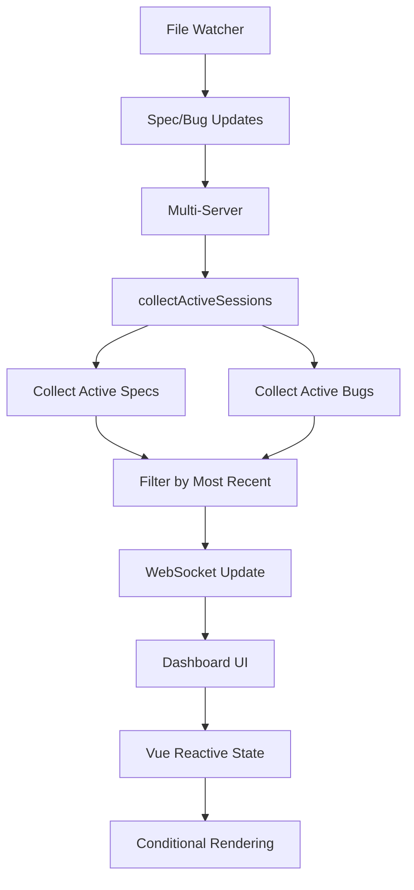

# Design: UI Improvements

✅ **APPROVED**

## Overview

This feature enhances the dashboard UI presentation by implementing conditional rendering based on item status (completed specs and resolved bugs) and extending the Active Sessions view to include bug tracking. The implementation leverages existing Vue.js reactive patterns and WebSocket infrastructure to provide a cleaner, more focused dashboard experience.

## Steering Document Alignment

### Technical Standards (tech.md)
- **Frontend Framework**: Continues using petite-vue for reactive UI updates
- **WebSocket Communication**: Extends existing real-time update patterns
- **State Management**: Leverages existing reactive state without adding complexity
- **Performance**: Maintains < 100ms response time for UI updates

### Project Structure (structure.md)
- **Dashboard Subsystem**: All changes contained within `src/dashboard/` directory
- **Public Assets**: UI modifications in `public/multi.html` and `public/multi-app.js`
- **Server Logic**: Extended active session collection in `multi-server.ts`
- **Parser Updates**: No changes needed - existing status fields sufficient

## Code Reuse Analysis

### Existing Components to Leverage
- **Status Display Logic**: Current `v-if` and `:class` bindings for conditional rendering
- **Active Sessions Infrastructure**: Existing `collectActiveTasks()` method and WebSocket updates
- **Bug Status System**: Current bug status states (analyzing, fixing, verifying, resolved)
- **Modification Time Tracking**: Existing `lastModified` fields on specs and bugs

### Integration Points
- **WebSocket Messages**: Extend `active-tasks-update` to include active bugs
- **UI State Management**: Leverage existing `activeTasks` array in Vue app
- **Project Discovery**: Use existing `hasActiveSession` tracking
- **Status Classes**: Reuse existing CSS class bindings for status styling

## Architecture

The solution maintains the current event-driven architecture with minimal changes:



## Components and Interfaces

### UI Components (multi.html)

- **Purpose:** Conditionally render spec and bug displays based on status
- **Interfaces:** Vue directives (v-if, v-show, :class)
- **Dependencies:** Vue reactive state from multi-app.js
- **Reuses:** Existing status display patterns and CSS classes

Key implementation examples:

```html
<!-- Spec progress bar - hide for completed -->
<div v-if="spec.tasks && spec.tasks.total > 0 && spec.status !== 'completed'" class="px-6 pb-3">
  <div class="w-full bg-gray-200 dark:bg-gray-700 rounded-full h-2">
    <!-- Progress bar content -->
  </div>
</div>

<!-- Task count - hide for completed -->
<span v-if="spec.tasks && spec.status !== 'completed'">
  <i class="fas fa-tasks mr-1"></i>
  {{ spec.tasks.completed }} / {{ spec.tasks.total }} tasks
</span>

<!-- Bug details - compact for resolved -->
<div v-if="bug.status !== 'resolved'" class="mt-2">
  <!-- Show severity, documents, next actions -->
</div>
<div v-else class="mt-1">
  <!-- Show only essential info -->
</div>
```

### Active Sessions Collector (multi-server.ts)

- **Purpose:** Collect and filter active work items (specs and bugs)
- **Interfaces:** `collectActiveSessions()` method replacing `collectActiveTasks()`
- **Dependencies:** SpecParser for bug and spec data
- **Reuses:** Existing task collection logic, extends to include bugs

Key changes:
- Rename to `collectActiveSessions()` for clarity
- Include bugs with active statuses
- Filter to single most recent item per project

### Active Session Interface

```typescript
// Discriminated union for type safety
type ActiveSession = ActiveSpecSession | ActiveBugSession;

interface BaseActiveSession {
  projectPath: string;
  projectName: string;
  displayName: string;
  lastModified: Date;
  isCurrentlyActive: boolean;
  hasActiveSession: boolean;
  gitBranch?: string;
  gitCommit?: string;
}

interface ActiveSpecSession extends BaseActiveSession {
  type: 'spec';
  specName: string;
  task: Task;
}

interface ActiveBugSession extends BaseActiveSession {
  type: 'bug';
  bugName: string;
  bugStatus: 'analyzing' | 'fixing' | 'verifying';
  bugSeverity?: 'critical' | 'high' | 'medium' | 'low';
  nextCommand: string;  // e.g., '/bug-fix bug-name'
}
```

## Data Models

### Extended ActiveTask/ActiveSession Model
```typescript
{
  // Existing fields maintained
  projectPath: string
  projectName: string
  
  // Enhanced fields
  type: 'spec' | 'bug'
  itemName: string
  displayName: string
  
  // Conditional fields
  task?: Task              // When type === 'spec'
  bugStatus?: string       // When type === 'bug'
  bugSeverity?: string     // When type === 'bug'
  
  // Metadata
  lastModified: Date
  isCurrentlyActive: boolean
  hasActiveSession: boolean
  gitBranch?: string
  gitCommit?: string
}
```

### No Database Changes
- All data derived from existing file system state
- No new persistent storage required

## Error Handling

### Error Scenarios

1. **Missing Modification Times**
   - **Detection:** Check if `lastModified` is null/undefined
   - **Handling:** Use fallback hierarchy: file mtime → file ctime → new Date()
   - **Code:**
     ```typescript
     const lastModified = spec.lastModified || 
                         (await fs.stat(specPath)).mtime || 
                         new Date();
     ```
   - **User Impact:** Items may appear in unexpected order but functionality preserved

2. **Concurrent Updates from Multiple Dashboards**
   - **Detection:** Compare WebSocket message timestamps
   - **Handling:** Last write wins for modification times, rely on file system as source of truth
   - **Code:**
     ```typescript
     // In file watcher
     const currentMtime = (await fs.stat(filePath)).mtime;
     if (currentMtime > lastKnownMtime) {
       // Process update
     }
     ```
   - **User Impact:** Active session may briefly show outdated item until next file system event

3. **Invalid or Corrupted Status Files**
   - **Detection:** Parse errors or unexpected status values
   - **Handling:** Log error, treat as inactive, exclude from active sessions
   - **Code:**
     ```typescript
     try {
       const status = parseBugStatus(content);
       if (!['analyzing', 'fixing', 'verifying'].includes(status)) {
         return null; // Exclude from active sessions
       }
     } catch (e) {
       debug(`Invalid bug status in ${bugName}: ${e}`);
       return null;
     }
     ```
   - **User Impact:** Item won't appear in active sessions until valid status

4. **WebSocket Connection Loss**
   - **Detection:** WebSocket readyState !== 1
   - **Handling:** Queue updates, retry on reconnection
   - **User Impact:** UI may show stale data until reconnection

## Testing Strategy

### Unit Testing

```typescript
// Test conditional rendering logic
describe('Compact Display Rendering', () => {
  it('should hide progress bar for completed specs', () => {
    const spec = { status: 'completed', tasks: { total: 10, completed: 10 } };
    expect(shouldShowProgressBar(spec)).toBe(false);
  });
  
  it('should hide bug details for resolved bugs', () => {
    const bug = { status: 'resolved' };
    expect(shouldShowBugDetails(bug)).toBe(false);
  });
});

// Test active session filtering
describe('Active Session Collection', () => {
  it('should include only most recent item per project', async () => {
    const project = {
      specs: [
        { name: 'old-spec', lastModified: new Date('2024-01-01'), tasks: { inProgress: '1' } },
        { name: 'new-spec', lastModified: new Date('2024-02-01'), tasks: { inProgress: '1' } }
      ],
      bugs: [
        { name: 'recent-bug', lastModified: new Date('2024-03-01'), status: 'fixing' }
      ]
    };
    const sessions = await collectActiveSessions([project]);
    expect(sessions).toHaveLength(1);
    expect(sessions[0].type).toBe('bug');
    expect(sessions[0].bugName).toBe('recent-bug');
  });
});
```

### Integration Testing

```typescript
describe('Dashboard WebSocket Integration', () => {
  it('should update UI when spec completes', async () => {
    // Setup WebSocket mock
    const ws = new WebSocketMock();
    
    // Send spec update
    ws.send({
      type: 'spec-update',
      data: { name: 'test-spec', status: 'completed' }
    });
    
    // Verify UI update
    await nextTick();
    const specElement = document.querySelector('[data-spec="test-spec"]');
    expect(specElement.querySelector('.progress-bar')).toBeNull();
  });
});
```

### End-to-End Testing

```typescript
describe('Dashboard UI Improvements E2E', () => {
  it('should show compact display for completed items', async () => {
    // Complete a spec
    await completeSpec('user-auth');
    
    // Verify compact display
    const specRow = await page.$('[data-spec="user-auth"]');
    const progressBar = await specRow.$('.progress-bar');
    expect(progressBar).toBeNull();
    
    // Verify click still expands details
    await specRow.click();
    const details = await specRow.$('.spec-details');
    expect(details).toBeTruthy();
  });
  
  it('should show only most recent active item per project', async () => {
    // Create multiple active items
    await createActiveSpec('spec-1');
    await createActiveBug('bug-1');
    
    // Verify active sessions
    const activeSessions = await page.$$('.active-session-item');
    expect(activeSessions).toHaveLength(1);
    
    // Verify it's the bug (most recent)
    const sessionType = await activeSessions[0].$eval('.session-type', el => el.textContent);
    expect(sessionType).toContain('bug');
  });
});
```