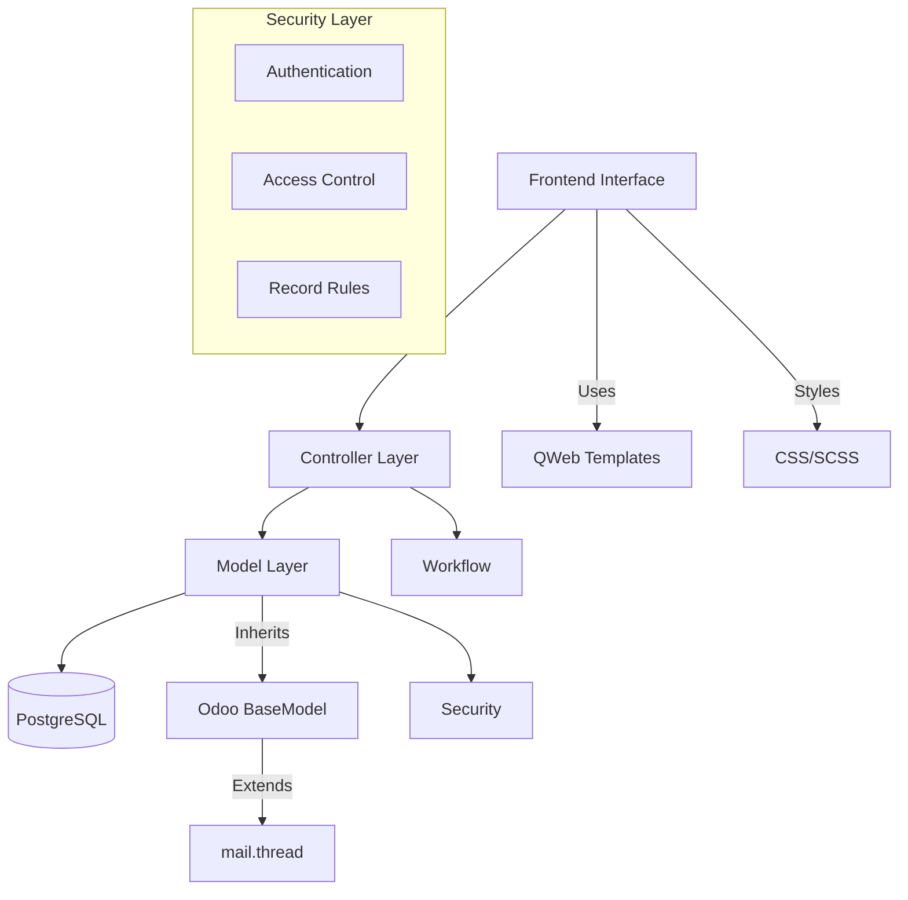
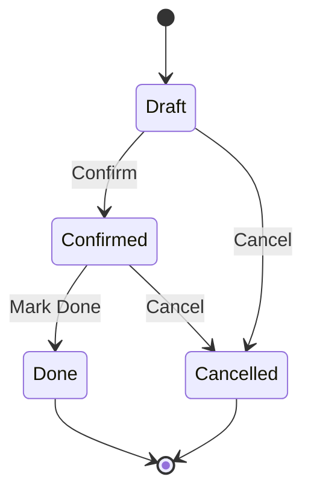

# Odoo Module Design Document - {{MODULE_NAME}}

## Module Overview

**Module Name:** {{MODULE_NAME}}  
**Technology Stack:** Python {{PYTHON_VERSION}} + Odoo {{ODOO_VERSION}}  
**Database:** PostgreSQL {{POSTGRESQL_VERSION}}  
**Architecture Pattern:** MVC (Model-View-Controller)

## Steering Documents Alignment

### Technical Stack (technical-stack.md)
- **Python Version:** Complies with {{PYTHON_VERSION}} standards
- **Code Style:** Follows PEP 8 and Odoo coding guidelines
- **Database Design:** Adheres to PostgreSQL best practices

### Module Standards (module-standards.md)
- **Module Structure:** Follows standard Odoo module architecture
- **File Naming:** Adheres to Odoo naming conventions
- **Version Control:** Follows semantic versioning

### Business Rules (business-rules.md)
- **Workflow:** Complies with established business process standards
- **Access Control:** Follows enterprise security policies
- **Data Processing:** Complies with data protection regulations

## Code Reuse Analysis

### Existing Component Utilization
- **res.partner:** Customer/supplier data foundation
- **mail.thread:** Messaging and tracking functionality
- **product.template:** Product data structure
- **account.move:** Accounting entry integration

### Integration Points Analysis
- **Sales Module (sale):** Order data synchronization
- **Purchase Module (purchase):** Procurement process integration  
- **Inventory Module (stock):** Inventory movement recording
- **Accounting Module (account):** Accounting entry automation

## System Architecture

### Overall Architecture Diagram


### Module Structure Design
```
{{MODULE_NAME}}/
├── __init__.py
├── __manifest__.py
├── models/
│   ├── __init__.py
│   ├── main_model.py              # Main business model (no module prefix in filename)
│   └── line_model.py              # Detail model
├── views/
│   ├── main_model_views.xml       # Main model views
│   └── menus.xml                  # Menu definitions
├── security/
│   ├── ir.model.access.csv        # Model access permissions
│   └── security_rules.xml         # Record-level security rules
├── data/
│   └── base_data.xml              # Base data
├── demo/
│   └── demo_data.xml              # Demo data
├── wizard/
│   └── action_wizard.py           # Wizards/assistants
├── report/
│   └── report_templates.xml       # Report templates
├── controllers/
│   └── main.py                    # Web controllers
├── i18n/
│   ├── {{MODULE_NAME}}.pot        # Translation template
│   ├── zh_TW.po                   # Traditional Chinese translation
│   └── en.po                      # English translation
└── static/
    ├── description/
    │   ├── icon.png               # Module icon
    │   └── index.html             # Module description page
    └── src/
        └── components/            # Frontend components (Odoo 17+ best practice)
            └── my_component/      # Individual component folder
                ├── my_component.js
                ├── my_component.xml
                └── my_component.scss
```

**File Naming Best Practices:**
- **Model Files**: Use descriptive names rather than module prefixes (e.g., `product.py` instead of `my_module_product.py`)
- **Frontend Components**: Use `static/src/components/` structure to organize JS/XML/SCSS files
- **View Files**: Name by functionality or model name for better maintainability

## Data Model Design

### Main Model
```python
class MainModel(models.Model):
    _name = '{{MODULE_NAME}}.main'
    _description = 'Main Business Model'
    _inherit = ['mail.thread', 'mail.activity.mixin']
    _order = 'name desc'

    name = fields.Char(
        string='Reference',
        required=True,
        copy=False,
        readonly=True,
        index=True,
        default=lambda self: self.env['ir.sequence'].next_by_code('{{MODULE_NAME}}.main')
    )
    
    state = fields.Selection([
        ('draft', 'Draft'),
        ('confirmed', 'Confirmed'),
        ('done', 'Done'),
        ('cancelled', 'Cancelled'),
    ], string='Status', default='draft', tracking=True)
    
    partner_id = fields.Many2one(
        'res.partner',
        string='Partner',
        required=True,
        tracking=True
    )
    
    line_ids = fields.One2many(
        '{{MODULE_NAME}}.line',
        'main_id',
        string='Lines'
    )
    
    total_amount = fields.Monetary(
        string='Total Amount',
        compute='_compute_total_amount',
        store=True,
        currency_field='currency_id'
    )
    
    currency_id = fields.Many2one(
        'res.currency',
        string='Currency',
        required=True,
        default=lambda self: self.env.company.currency_id
    )
    
    company_id = fields.Many2one(
        'res.company',
        string='Company',
        required=True,
        default=lambda self: self.env.company
    )
    
    @api.depends('line_ids.subtotal')
    def _compute_total_amount(self):
        for record in self:
            record.total_amount = sum(record.line_ids.mapped('subtotal'))
    
    def action_confirm(self):
        self.write({'state': 'confirmed'})
        return True
    
    def action_done(self):
        self.write({'state': 'done'})
        return True
    
    def action_cancel(self):
        self.write({'state': 'cancelled'})
        return True
```

### Line Model
```python
class LineModel(models.Model):
    _name = '{{MODULE_NAME}}.line'
    _description = 'Detail Line Model'

    main_id = fields.Many2one(
        '{{MODULE_NAME}}.main',
        string='Main Record',
        required=True,
        ondelete='cascade'
    )
    
    product_id = fields.Many2one(
        'product.product',
        string='Product',
        required=True
    )
    
    quantity = fields.Float(
        string='Quantity',
        default=1.0,
        digits='Product Unit of Measure'
    )
    
    unit_price = fields.Monetary(
        string='Unit Price',
        currency_field='currency_id'
    )
    
    subtotal = fields.Monetary(
        string='Subtotal',
        compute='_compute_subtotal',
        store=True,
        currency_field='currency_id'
    )
    
    currency_id = fields.Many2one(
        related='main_id.currency_id',
        store=True
    )
    
    @api.depends('quantity', 'unit_price')
    def _compute_subtotal(self):
        for line in self:
            line.subtotal = line.quantity * line.unit_price
    
    @api.constrains('quantity')
    def _check_quantity(self):
        for line in self:
            if line.quantity <= 0:
                raise ValidationError(_('Quantity must be greater than zero.'))
```

## User Interface Design

### Form View Structure
```xml
<record id="view_main_model_form" model="ir.ui.view">
    <field name="name">main.model.form</field>
    <field name="model">{{MODULE_NAME}}.main</field>
    <field name="arch" type="xml">
        <form string="Main Model">
            <header>
                <button name="action_confirm" type="object" 
                        string="Confirm" class="btn-primary"
                        attrs="{'invisible': [('state', '!=', 'draft')]}"/>
                <button name="action_done" type="object" 
                        string="Mark Done" class="btn-primary"
                        attrs="{'invisible': [('state', '!=', 'confirmed')]}"/>
                <button name="action_cancel" type="object" 
                        string="Cancel"
                        attrs="{'invisible': [('state', 'in', ['done', 'cancelled'])]}"/>
                <field name="state" widget="statusbar" 
                       statusbar_visible="draft,confirmed,done"/>
            </header>
            <sheet>
                <group>
                    <group>
                        <field name="name"/>
                        <field name="partner_id"/>
                    </group>
                    <group>
                        <field name="currency_id"/>
                        <field name="total_amount"/>
                    </group>
                </group>
                <notebook>
                    <page string="Lines">
                        <field name="line_ids">
                            <tree editable="bottom">
                                <field name="product_id"/>
                                <field name="quantity"/>
                                <field name="unit_price"/>
                                <field name="subtotal"/>
                            </tree>
                        </field>
                    </page>
                </notebook>
            </sheet>
            <div class="oe_chatter">
                <field name="message_follower_ids"/>
                <field name="message_ids"/>
            </div>
        </form>
    </field>
</record>
```

### Tree View Structure
```xml
<record id="view_main_model_tree" model="ir.ui.view">
    <field name="name">main.model.tree</field>
    <field name="model">{{MODULE_NAME}}.main</field>
    <field name="arch" type="xml">
        <tree string="Main Models">
            <field name="name"/>
            <field name="partner_id"/>
            <field name="total_amount"/>
            <field name="state"/>
            <field name="create_date"/>
        </tree>
    </field>
</record>
```

## Security Model

### Access Control Matrix
```csv
id,name,model_id:id,group_id:id,perm_read,perm_write,perm_create,perm_unlink
access_main_model_user,access_main_model_user,model_{{MODULE_NAME}}_main,base.group_user,1,1,1,1
access_main_model_manager,access_main_model_manager,model_{{MODULE_NAME}}_main,base.group_system,1,1,1,1
access_line_model_user,access_line_model_user,model_{{MODULE_NAME}}_line,base.group_user,1,1,1,1
access_line_model_manager,access_line_model_manager,model_{{MODULE_NAME}}_line,base.group_system,1,1,1,1
```

### Record Rules
```xml
<record id="rule_main_model_multi_company" model="ir.rule">
    <field name="name">Main Model Multi-Company</field>
    <field name="model_id" ref="model_{{MODULE_NAME}}_main"/>
    <field name="global" eval="True"/>
    <field name="domain_force">['|',('company_id','=',False),('company_id','in',company_ids)]</field>
</record>
```

## Workflow Design

### State Transitions


### Business Logic Flow
1. **Draft State**: Initial state, editable
2. **Confirmed State**: Locked for editing, ready for processing
3. **Done State**: Completed, archived
4. **Cancelled State**: Terminated, archived

## Integration Specifications

### Sales Integration
- Automatic creation from sale orders
- Status synchronization
- Customer information mapping

### Inventory Integration
- Stock movement generation
- Product availability checking
- Location management

### Accounting Integration
- Automatic journal entries
- Tax calculation
- Multi-currency support

## Performance Considerations

### Database Optimization
- Proper indexing on frequently queried fields
- Efficient compute method dependencies
- Optimized search domains

### Query Optimization
```python
# Good: Use specific field selection
records = self.env['{{MODULE_NAME}}.main'].search_read(
    [('state', '=', 'confirmed')],
    ['name', 'partner_id', 'total_amount']
)

# Avoid: Loading all fields
records = self.env['{{MODULE_NAME}}.main'].search([('state', '=', 'confirmed')])
```

### Memory Management
- Lazy loading for large datasets
- Batch processing for bulk operations
- Proper recordset handling

## Testing Strategy

### Unit Testing
```python
from odoo.tests.common import TransactionCase

class TestMainModel(TransactionCase):
    
    def setUp(self):
        super().setUp()
        self.main_model = self.env['{{MODULE_NAME}}.main']
        self.partner = self.env.ref('base.res_partner_1')
    
    def test_create_main_record(self):
        record = self.main_model.create({
            'partner_id': self.partner.id,
        })
        self.assertEqual(record.state, 'draft')
        self.assertTrue(record.name)
    
    def test_state_transitions(self):
        record = self.main_model.create({
            'partner_id': self.partner.id,
        })
        record.action_confirm()
        self.assertEqual(record.state, 'confirmed')
```

## Deployment Checklist

### Pre-deployment Validation
- [ ] All unit tests passing
- [ ] Security permissions configured
- [ ] Demo data verified
- [ ] Performance benchmarks met
- [ ] Code review completed

### Post-deployment Monitoring
- [ ] Error logging configured
- [ ] Performance monitoring active
- [ ] User feedback collection
- [ ] System health checks

---

**Last Updated:** {{CURRENT_DATE}}  
**Document Version:** 1.0  
**Approval Status:** [Pending/Approved]